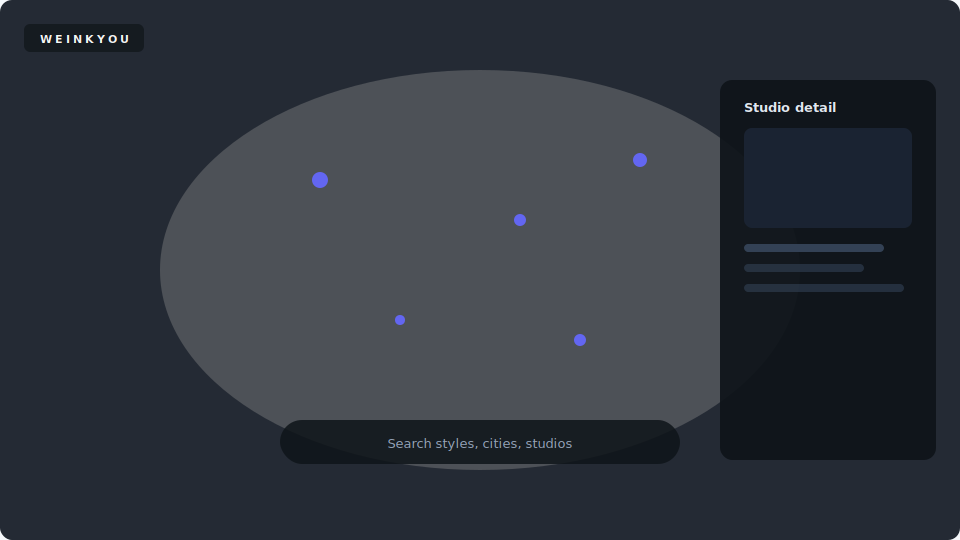

<div align="center">


<br/><br/>

**Mercedes-Benz PO by day · AI product builder by night**

[](https://linkedin.com/in/YOUR_HANDLE)
[](https://YOUR_DOMAIN)
[](mailto:YOUR_EMAIL)

</div>
---

## ✦ Selected work

<table>
<tr>
<td width="50%" align="center">

### 🌍 WEINKYOU
**Emotion before utility**

Map-first global discovery · 12k+ studios · premium Mapbox UX

*Proprietary product*

[Case study →](https://github.com/rl000a/showcase-weinkyou)



</td>
<td width="50%" align="center">

### 🎯 AI Cost Center Companion
**Cursor spend, finally attributed**

Which cost center paid for AI? Local-first. No IDE hacks.

*Source in private repo*

[Case study →](https://github.com/rl000a/showcase-ai-cost-center)


</td>
</tr>
<tr>
<td width="50%" align="center">

### 📋 Journey Planning Hub
**PI planning without spreadsheet chaos**

Rank → capacity → readiness → **commit** to Jira

*Enterprise case study · sanitized*

[Case study →](https://github.com/rl000a/showcase-journey-planning)

</td>
<td width="50%" align="center">

### 🔌 Cursor & AI Ops
**Runbooks · MCP · n8n**

Patterns from enterprise AI governance — published as **playbooks**, not proprietary code

*Coming to showcase repos*

</td>
</tr>
</table>

---

## ✦ What I optimize for

```
Product instinct  →  Does this solve a real pain?
Craft             →  Does it feel premium?
Trust             →  Local-first · commitment gates · honest metrics
Speed             →  Cursor · Claude · ship in days not quarters
```

---

## ✦ Stack

`Cursor` · `Claude` · `TypeScript` · `Rust` · `Next.js` · `Tauri` · `Mapbox` · `MCP` · `n8n`

---

## ✦ Activity

<div align="center">


<br/>


</div>

---

<div align="center">

### Building AI products people trust — and feel.

*Private repos & live demos available for the right conversation.*

<br/>

**[LinkedIn](https://linkedin.com/in/YOUR_HANDLE)** · **[Email](mailto:YOUR_EMAIL)**

</div>
